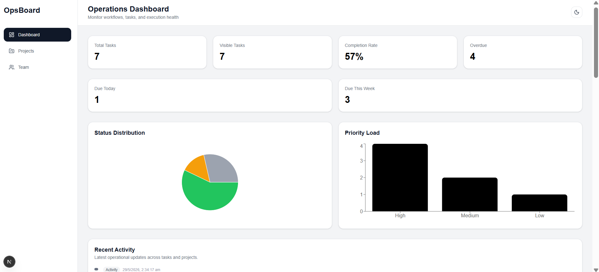
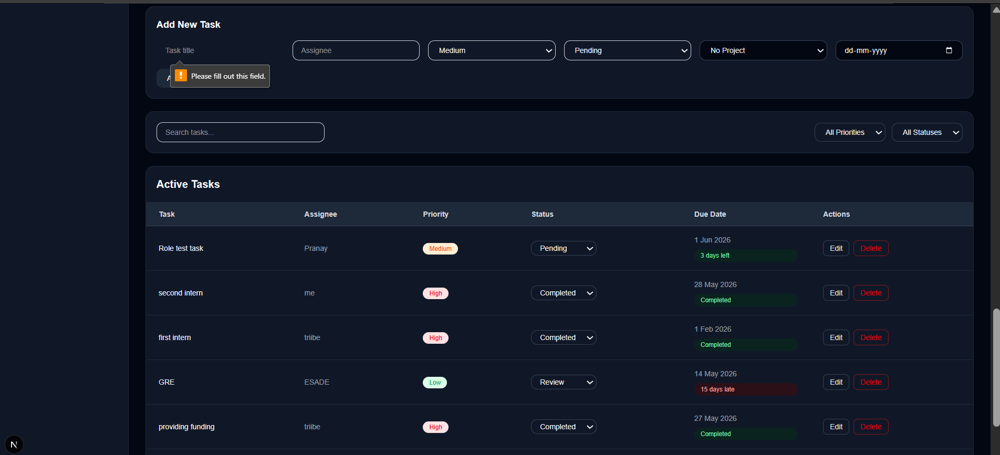
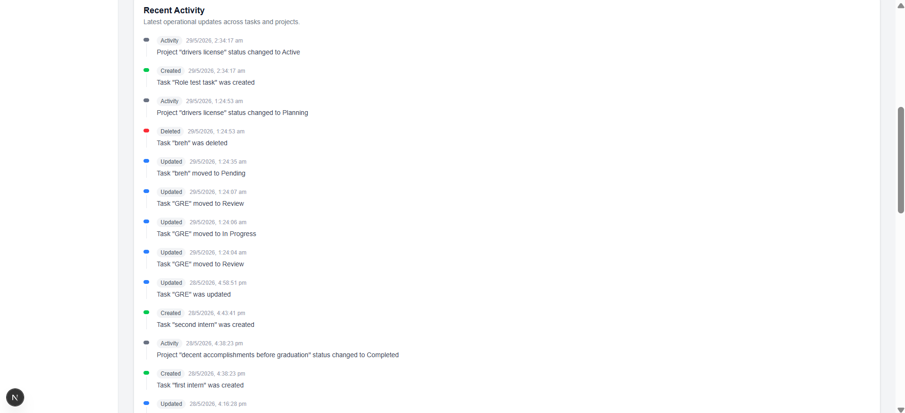
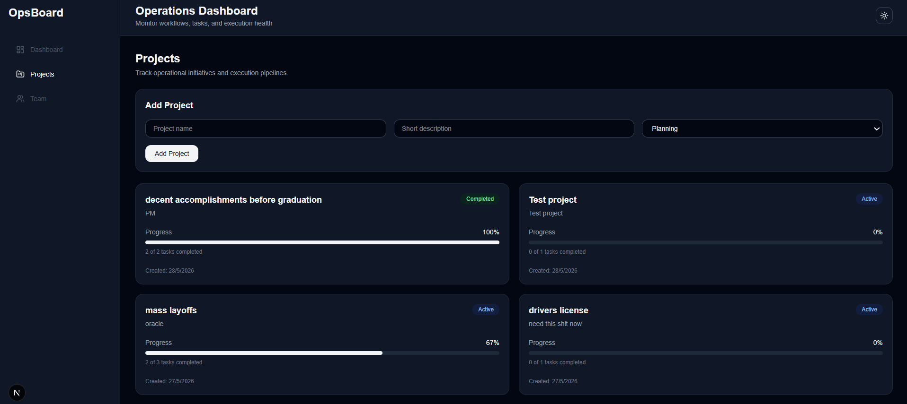
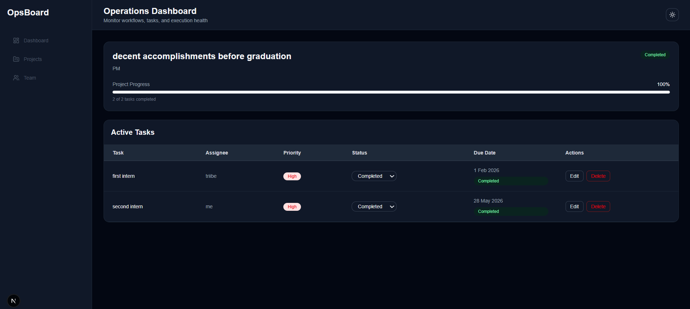
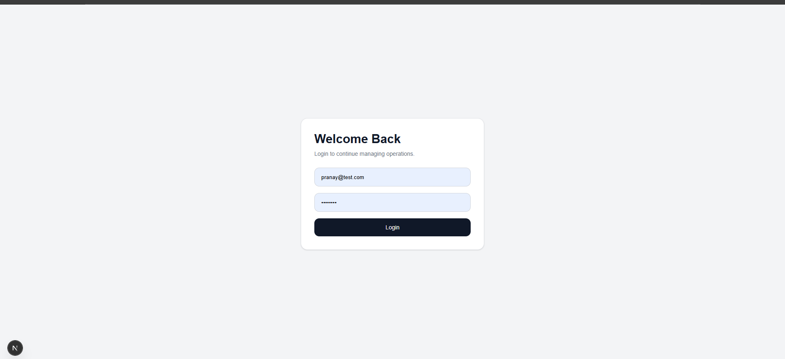
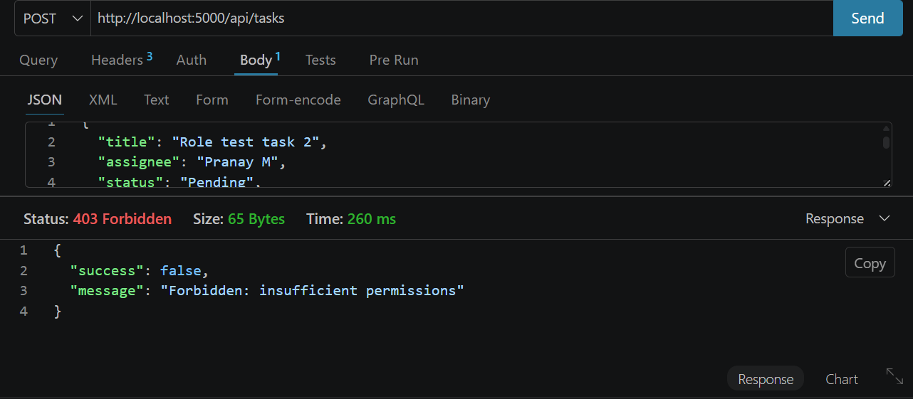
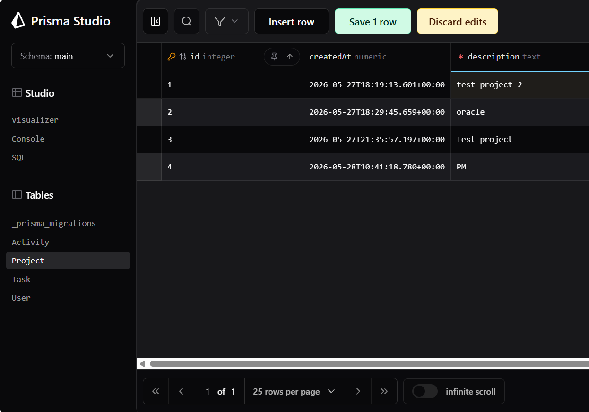
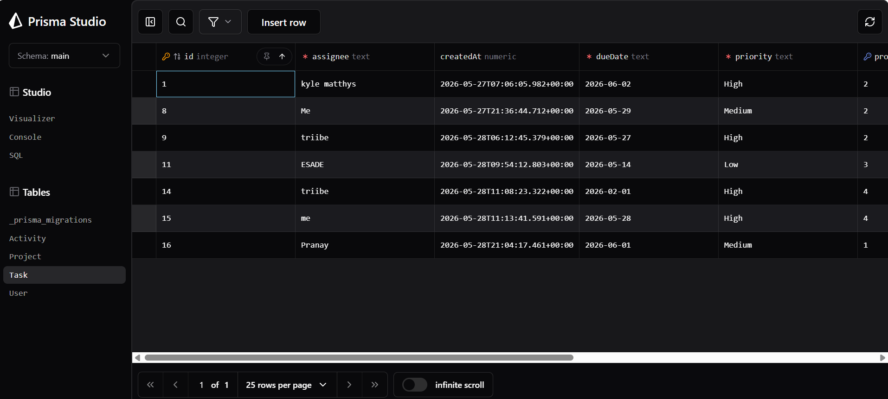
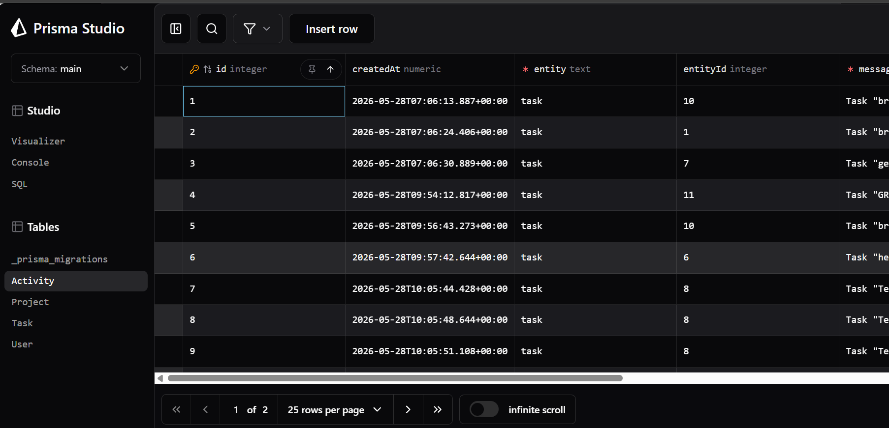

# Startup Operations Dashboard


A full-stack operations management platform built to help teams organize projects, track execution, monitor operational health, and maintain visibility across workflows.

The platform combines project management, task tracking, activity auditing, deadline intelligence, analytics, and role-based access control into a single operational workspace.

Built with **Next.js**, **TypeScript**, **Express.js**, **Prisma ORM**, and **JWT Authentication**.

---

## Why I Built This

Most project management applications focus on storing tasks. I wanted to build a system that focuses on **operational visibility**.

This project goes beyond basic CRUD operations by introducing:

* Activity auditing
* Project progress intelligence
* Deadline awareness
* Analytics dashboards
* Role-based permissions
* Secure authentication
* Relational data management

The goal was to build something that resembles how internal operational tools are designed in real startups.

---

## Live Demo

🌐 Frontend: https://startup-operations-dashboard.vercel.app

⚙️ Backend API: https://startup-operations-dashboard-production.up.railway.app

Demo Credentials:

Email: pranay@test.com
Password: test1234

---

# Features

## Authentication & Security

* JWT-based authentication
* Password hashing using bcrypt
* Protected frontend routes
* Protected backend APIs
* Persistent login sessions
* Role-Based Access Control (RBAC)

---

## Project Management

* Create and manage projects
* Track project lifecycle stages
* Automatic project progress calculation
* Project detail views
* Real-time completion tracking

---

## Task Management

* Create, update, and delete tasks
* Task assignment workflows
* Priority management
* Status transitions
* Due date tracking
* Project-task relationships

---

## Operational Intelligence

* Overdue task detection
* Deadline awareness
* Completion rate monitoring
* Status distribution analytics
* Priority load analysis

---

## Activity Logging System

Every important action performed inside the system is automatically logged.

Examples include:

* Task creation
* Task updates
* Task deletion
* Status transitions
* Project status synchronization

This provides visibility into operational history and creates an audit trail of system activity.

---

# Application Walkthrough

## Operations Dashboard



The dashboard serves as the operational command center, providing visibility into execution health through analytics, charts, task metrics, and recent activity.

---

## Task Management



Tasks can be assigned, prioritized, tracked, and monitored through deadline-aware workflows.

Features include:

* Priority management
* Due date intelligence
* Status tracking
* Project associations
* Execution monitoring

---

## Activity Timeline



All operational events are automatically recorded and surfaced through a centralized timeline.

This makes it easier to understand what changed, when it changed, and how the system evolved over time.

---

## Projects Overview



Projects display:

* Completion progress
* Current lifecycle status
* Associated task completion
* Operational health

Progress is automatically derived from underlying task execution.

---

## Project Detail View



Each project contains its own execution workspace with task-level visibility and progress tracking.

---

## Authentication System



The platform uses JWT authentication to secure user sessions and protect application routes.

---

## Role-Based Access Control



Administrative actions are protected through backend-enforced role checks.

Users without sufficient permissions are blocked from restricted operations.

---

# System Architecture

```text
                        Client (Next.js)
                                │
                                ▼
                     JWT Authentication Layer
                                │
                                ▼
                        Express API Server
                                │
         ┌──────────────────────┼──────────────────────┐
         ▼                      ▼                      ▼
      Users                Projects                Tasks
                                                       │
                                                       ▼
                                              Activity Logging
                                                       │
                                                       ▼
                                                 Prisma ORM
                                                       │
                                                       ▼
                                                   Database
```

---

# Database Design

The application uses Prisma ORM for data modeling and persistence.

Core entities include:

### Users

* Authentication
* Authorization
* Role management

### Projects

* Project metadata
* Lifecycle status
* Progress tracking

### Tasks

* Assignments
* Priorities
* Deadlines
* Execution status

### Activities

* Audit events
* Timeline generation
* Operational history

---

## Project Records



---

## Task Records



---

## Activity Records



---

# REST API Overview

## Authentication

```http
POST /api/auth/register
POST /api/auth/login
```

## Projects

```http
GET    /api/projects
GET    /api/projects/:id
POST   /api/projects
```

## Tasks

```http
GET     /api/tasks
POST    /api/tasks
PUT     /api/tasks/:id
PATCH   /api/tasks/:id/status
DELETE  /api/tasks/:id
```

## Activities

```http
GET /api/activities
```

---

# Tech Stack

## Frontend

* Next.js
* React
* TypeScript
* Tailwind CSS

## Backend

* Node.js
* Express.js
* TypeScript

## Database

* Prisma ORM
* SQLite (Development)

## Authentication

* JWT
* bcrypt

## Development Tools

* Prisma Studio
* Thunder Client
* Git
* GitHub

---

# Folder Structure

```text
client/
├── app/
├── components/
├── contexts/
├── hooks/
├── services/
└── types/

server/
├── controllers/
├── middleware/
├── prisma/
├── routes/
├── types/
└── utils/
```

---

# Running Locally

Clone the repository:

```bash
git clone <https://github.com/Pranaycantcode/startup-operations-dashboard.git>
```

Install dependencies:

```bash
cd client
npm install

cd ../server
npm install
```

Start the backend:

```bash
npm run dev
```

Start the frontend:

```bash
npm run dev
```

---

# Current Highlights

* Full-stack architecture
* JWT authentication
* Role-based authorization
* Activity auditing system
* Prisma ORM integration
* Analytics dashboard
* Deadline intelligence
* Auto-synced project progress
* Relational data modeling
* Modular frontend and backend structure

---

# Future Improvements

* Production deployment
* PostgreSQL migration
* Team collaboration features
* Notifications system
* File attachments
* Advanced analytics
* User-owned projects
* Dashboard customization

---

# Author

*Pranay Mishra*

Mechanical Engineering, BIT Mesra

Interested in full-stack development, startup operations, product building, and scalable software systems.

LinkedIn: *(https://www.linkedin.com/in/pranay--mishra/)*

GitHub: *(https://github.com/Pranaycantcode)*
